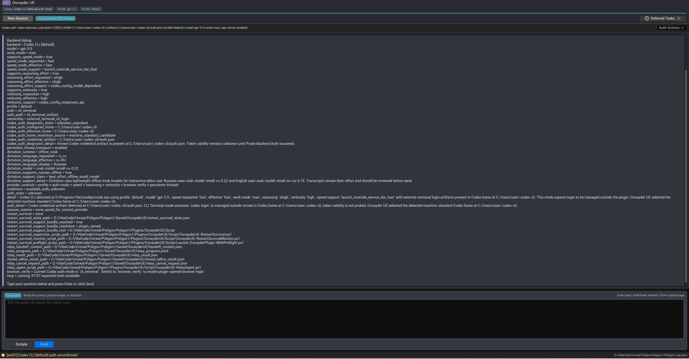
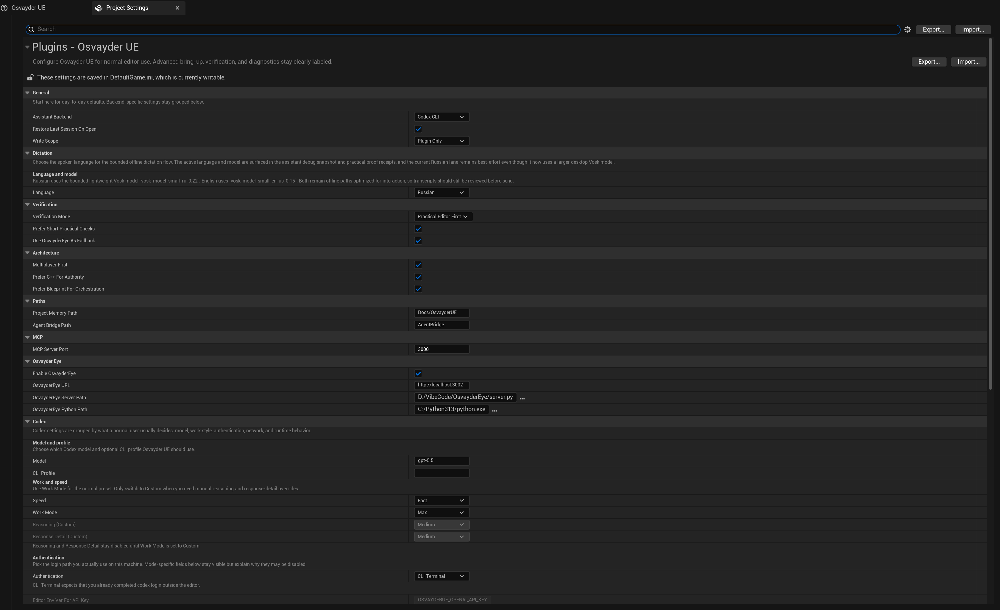

# Osvayder UE Core

Codex-first source-beta Unreal Engine 5.7 development agent.

Osvayder UE Core is the open-source core of Osvayder UE: an Unreal Editor
development-agent plugin with an in-editor agent panel, local MCP tools for
inspecting and changing editor state, restart-survival workflows, and
verification-oriented automation.

This repository is a source beta for developers and reviewers who can build a
C++ Unreal plugin from source. It is not a prebuilt Marketplace plugin or a
one-click installer yet.

`Core` means this repository contains the public development-agent foundation:
editor UI, MCP bridge, safety and verification docs, and core Unreal tooling. Future
Osvayder integrations, hosted services, packaged binaries, or commercial
distribution tracks may live outside this repository.

Repository: [osvayder/OsvayderUE-Core](https://github.com/osvayder/OsvayderUE-Core)

## Current Status

- Version: `1.1`
- Package type: source beta, no prebuilt binaries
- Primary target: Unreal Engine `5.7`
- Platform: Win64 editor plugin
- Runtime default: Codex CLI
- Public maturity: beta / reviewer-ready source export
- Release posture: not claimed to be Marketplace-ready
- Compatibility outside Unreal Engine `5.7` is not currently claimed
- Public plugin path: `Plugins/OsvayderUE/`
- Descriptor: `Plugins/OsvayderUE/OsvayderUE.uplugin`
- Module: `OsvayderUE`

## Screenshots

### Main widget



### Project settings



### Restart-survival / recovery flow


## What It Can Do

Osvayder UE gives AI agents controlled access to Unreal Editor through a local
MCP tool layer.

### Development Agent UI

- In-editor development-agent panel for Codex workflows.
- Backend status, model/profile controls, and prompt history.
- Project context from Unreal modules, plugins, assets, settings, logs, and
  local docs.
- Image paste and viewport capture support for visual tasks.
- Dictation support for prompt input.

### Unreal Editor Tools

- Inspect and modify actors in the current level.
- Spawn, move, delete, and update actor properties.
- Open levels and query level state.
- Read output logs and run console commands.
- Execute approved editor scripts.
- Capture the active viewport for visual review.

### Asset And Blueprint Tools

- Search assets and inspect dependencies/referencers.
- Query and modify Blueprints.
- Modify Animation Blueprints.
- Work with materials and character-related assets.
- Handle Enhanced Input assets and mappings.
- Support local animation pack intake and retarget fixup workflows.

### Advanced Unreal Domains

- C++ reflection and Live Coding oriented workflows.
- Gameplay Ability System tooling.
- Niagara tooling.
- Sequencer tooling.
- AI tooling.
- Multiplayer/OnlineSubsystem oriented checks.
- Map runtime proof and mechanic preflight checks.

### Task And Recovery System

- Async MCP task queue for longer editor operations.
- Deferred task browser.
- Restart-survival workflow for tasks that need Unreal Editor to close and
  reopen.
- Relay/progress/result files for recovery after editor restarts.
- Execution logs, trace status, report artifacts, and exportable proof notes.

### Safety And Verification

- Mutation lifecycle around risky editor changes.
- Save/compile/reporting receipts.
- Capability and risk boundaries for tool execution.
- Diagnostics for backend auth, MCP server state, task state, and plugin
  settings.

## Runtime Direction

Osvayder UE Core is built around Codex workflows: explicit context, scoped tool
calls, editor-side diagnostics, restart-survival, and reviewable proof receipts.

Codex CLI is the public-beta runtime default. Claude CLI support remains only as
a legacy/experimental compatibility path for existing configurations and should
not be treated as the main product path.

## Quick Start

Requirements:

- Unreal Engine `5.7` and a C++ Unreal host project.
- Node.js 18 or newer for the bundled MCP bridge.
- A configured Codex CLI or MCP-compatible client for AI-assisted workflows.

Setup:

1. Copy `Plugins/OsvayderUE/` into the host project's `Plugins/` directory.
2. Install and test the MCP bridge dependencies:

   ```powershell
   cd Plugins/OsvayderUE/Resources/mcp-bridge
   npm install
   npm test
   ```

3. Regenerate project files and build the host editor target.
4. Launch Unreal Editor and enable the Osvayder UE plugin if needed.
5. Open the Osvayder UE development-agent UI from the plugin menu or toolbar entry.
6. Start with a small read-only prompt, then run the checks in
   [Docs/Verification.md](Docs/Verification.md).

For detailed setup, see [Docs/Installation.md](Docs/Installation.md) and
[Docs/QuickStart.md](Docs/QuickStart.md).

## Origin And Direction

Osvayder UE Core began as a derivative of Natfii's UnrealClaude `1.4.0`, an
Unreal Editor plugin originally focused on Claude Code CLI workflows. That
upstream origin is preserved in [LICENSE](LICENSE), [NOTICE.md](NOTICE.md), and
[Plugins/OsvayderUE/NOTICE.md](Plugins/OsvayderUE/NOTICE.md).

The current project has a different product direction: Codex-first,
editor-aware, verification-oriented Unreal automation. The goal is not just a
detached chat panel inside Unreal, but a bounded development-agent surface that can
inspect editor state, run scoped MCP tools, recover from editor restarts, and
leave reviewable proof for risky changes.

Most Osvayder-side work is shaped around Codex workflows and intended for
Codex-first usage: explicit context, scoped tool calls, restart-survival,
diagnostics, verification receipts, and safer mutation boundaries.

Compared with the original UnrealClaude foundation, Osvayder UE Core adds:

- Codex-first workflows instead of Claude-only usage.
- Provider-aware settings, sessions, and diagnostics.
- Restart-survival and deferred task recovery.
- Larger MCP tool surface for gameplay, assets, Blueprints, C++, visual proof,
  and editor automation.
- Verification-oriented receipts for risky changes.
- Public source packaging as the independent Osvayder UE Core line starting at
  version `1.1`.

## Repository Layout

```text
OsvayderUE-Core/
  Plugins/
    OsvayderUE/
      Source/
      Config/
      Resources/
      OsvayderUE.uplugin
      LICENSE
  Docs/
  Examples/
```

## Documentation

- [Installation](Docs/Installation.md)
- [Quick Start](Docs/QuickStart.md)
- [Codex Workflow](Docs/CodexWorkflow.md)
- [Verification](Docs/Verification.md)
- [Architecture](Docs/Architecture.md)
- [Roadmap](Docs/Roadmap.md)
- [Safety Audit](Docs/SafetyAudit.md)
- [Branding Compatibility](Docs/BrandingCompatibility.md)
- [OpenAI Reviewer Summary](Docs/OpenAIReviewerSummary.md)
- [Grant Use](GRANT.md)
- [Notice](NOTICE.md)

## Contributing

See [CONTRIBUTING.md](CONTRIBUTING.md). Issues and pull requests are welcome,
especially around public packaging, verification, safety, and Unreal workflow
ergonomics.

## License

The core plugin is staged under MIT with preserved upstream attribution.

- Upstream-derived portions retain copyright notice for Natali Caggiano
  (Natfii), based on the UnrealClaude `1.4.0` archive baseline.
- Osvayder-authored modifications, additions, documentation, packaging, product
  identity, and the independent public line starting at Osvayder UE Core `1.1`
  are copyright Osvayder.
- Some bundled subcomponents retain their own license files; review
  `Plugins/OsvayderUE/Resources/mcp-bridge/LICENSE` before redistribution.

See [NOTICE.md](NOTICE.md) and [Plugins/OsvayderUE/NOTICE.md](Plugins/OsvayderUE/NOTICE.md).
