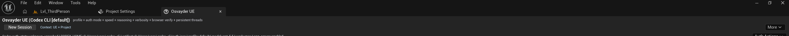
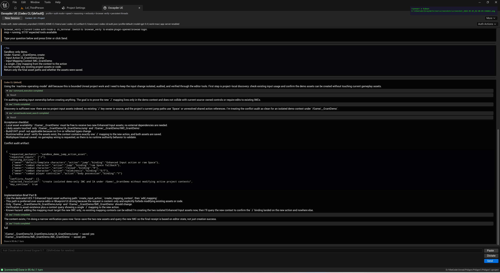
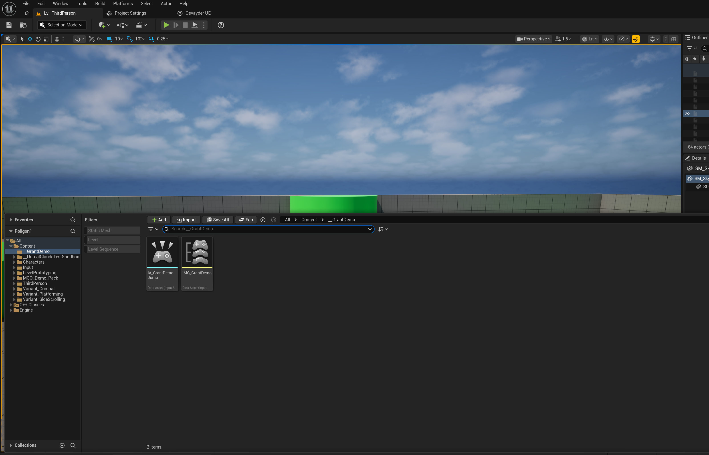
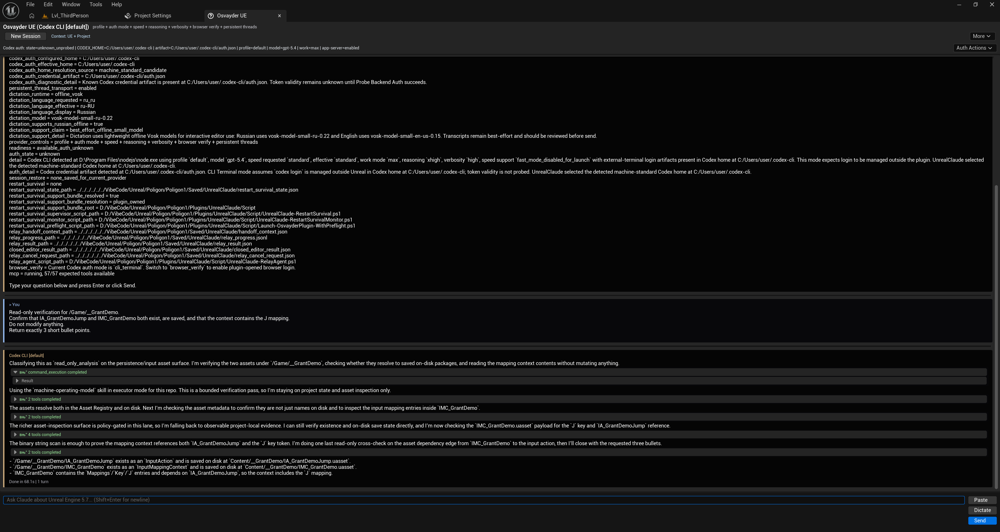
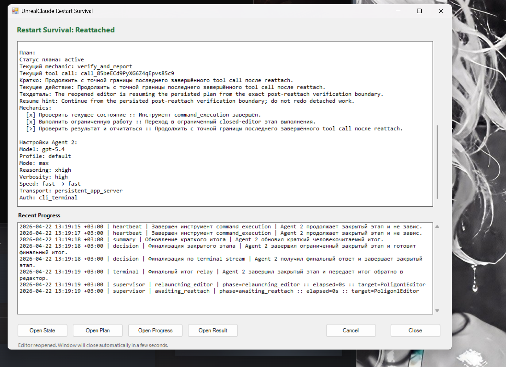

# Osvayder UE Core

Osvayder UE Core is an Unreal Engine 5 editor-assistant plugin focused on safe AI-assisted development workflows inside Unreal Editor: MCP tooling, editor-aware execution, restart-survival, verification receipts, and bounded automation for UE projects.

It is being developed as an open-source core for Codex-first Unreal workflows rather than as a generic chat panel. The project is aimed at developers, technical artists, and small teams who want a stronger execution/verification layer around real UE editor tasks.

## Project Origin

Osvayder UE Core originated from an earlier open-source Unreal assistant base that supported Claude-oriented workflows inside Unreal Editor. Since then, the system has been substantially reworked around Codex-first execution, stronger verification boundaries, restart-survival, MCP tooling, sandbox-safe mutation, and broader Unreal editor automation. Current maintenance and product direction are led by Osvayder.

For the first public OSS release, the plugin remains under `Plugins/UnrealClaude/` for compatibility with the existing Unreal module and descriptor names. User-facing branding is `Osvayder UE`; a full module/package rename is intentionally deferred.

## What It Already Does

- Exposes an Unreal-aware HTTP/MCP tool surface for editor tasks.
- Runs bounded AI-assisted project work with verification-first closeout.
- Supports restart-survival flows for reflected C++ / editor restart cases.
- Preserves structured receipts and evidence for build/runtime/manual verification.
- Supports sandbox-safe mutation flows instead of blindly editing project state.
- Includes hardening coverage for failure injection, async cancellation, dirty package lifecycle, and bounded mini-feature workflows.

## Current Status

- Version: `1.4.1`
- Public maturity: beta / controlled dogfood ready
- OSS state: public core export is live; deeper public packaging and product-hardening continue
- Public release claim: not Marketplace-ready yet; repository is intended for open-source collaboration, validation, and grant/maintainer support

## Screenshots

### Plugin panel


### Live read-only session


### Sandbox asset authoring result


### Verification response


### Restart-survival / recovery flow


## Repository Layout

```text
OsvayderUE-Core/
  Plugins/
    UnrealClaude/
      Source/
      Config/
      Resources/
      UnrealClaude.uplugin
      LICENSE
  Docs/
  Examples/
```

## Documentation

- [Installation](Docs/Installation.md)
- [Quick Start](Docs/QuickStart.md)
- [Architecture](Docs/Architecture.md)
- [Codex Workflow](Docs/CodexWorkflow.md)
- [Verification](Docs/Verification.md)
- [Roadmap](Docs/Roadmap.md)
- [Safety Audit](Docs/SafetyAudit.md)
- [Branding Compatibility](Docs/BrandingCompatibility.md)

## Roadmap Focus

Near-term work is focused on:

1. clean public package validation from a fresh clone;
2. public-facing descriptor/branding cleanup;
3. visible editor UI proof and screenshot refresh;
4. continued auth/security hardening;
5. deeper domain coverage for animation, map placement, and advanced gameplay workflows.

## Contributing

See [CONTRIBUTING.md](CONTRIBUTING.md). Issues and pull requests are welcome, especially around public packaging, verification, safety, and Unreal workflow ergonomics.

## License

The core plugin is staged under MIT. Some bundled subcomponents retain their own license files; review `Plugins/UnrealClaude/Resources/mcp-bridge/LICENSE` before redistribution.
